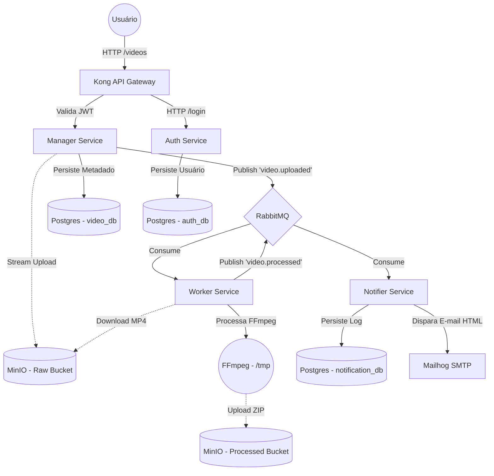

# FIAP X - Arquitetura de Microsserviços 🚀

Esta é a fundação da arquitetura **FIAP X**, um sistema distribuído projetado para o processamento assíncrono de vídeos. Para atender aos rígidos requisitos de escalabilidade, resiliência e qualidade estrutural, a aplicação foi desenhada utilizando **Event-Driven Architecture**, **Database-per-service** e **Clean Architecture (Ports & Adapters / Hexagonal)**.

Este repositório (`fiapx-infra`) atua como o **Centro de Operações** e **Source of Truth (GitOps)** do sistema. Ele contém os manifestos Kubernetes e Scripts para a subida de toda a arquitetura de suporte (Gateway, Message Broker, Bancos de Dados, Object Storage, Mailer e CI/CD).

## 🏗️ System Design e Ecosistema

O ecossistema está particionado em 5 repositórios independentes para garantir ciclos de release autônomos (CI/CD isolado):

1. **`fiapx-infra` (Este repositório):** Orquestração K8s, ConfigMaps, Secrets, Persistência e Gateway (Kong).
2. **`fiapx-auth`:** Microsserviço de Identidade. Gerencia cadastros, logins e emissão criptográfica de JSON Web Tokens (JWT). Banco de Dados: `auth_db`.
3. **`fiapx-manager`:** Microsserviço transacional (Core). Expõe a API pública protegida para upload de vídeos via stream para o MinIO, gerencia metadados no Postgres e publica eventos no RabbitMQ. Banco de Dados: `video_db`.
4. **`fiapx-worker`:** Serviço em Background (Consumer). Lê a fila do RabbitMQ com controle de concorrência (`prefetch=1`), baixa o vídeo, processa extração de frames via FFmpeg em disco efêmero (`/tmp`), gera o `.zip` e faz o upload pro MinIO.
5. **`fiapx-notifier`:** Serviço Mensageiro (Consumer). Ouve eventos de sucesso ou falha na fila e dispara e-mails transacionais dinâmicos simulados pelo Mailhog. Banco de Dados: `notification_db`.

### Fluxo Arquitetural (E2E)



## 🛠️ Como rodar o Projeto Localmente

A aplicação foi empacotada para rodar integralmente dentro de um cluster Kubernetes local via **Minikube**. Siga o passo a passo para inicializar o cluster e subir toda a stack de ponta-a-ponta (Bancos de dados e Aplicações).

### Pré-requisitos Fundamentais
* **Docker Desktop** (Engine do Docker ativa)
* **Minikube** e **kubectl** (Nas variáveis de PATH)
* Terminal interativo: Git Bash no Windows, WSL ou PowerShell nativo.

### Passo 1: Inicializar o Cluster com Recursos
Antes de aplicar os manifestos, inicie o Minikube exigindo recursos de memória suficientes para suportar todos os 14 PODs (Microsserviços + Bancos + Brokers + APM):
```bash
minikube start --memory=4096 --cpus=4
```

### Passo 2: Implantar a Infraestrutura e Microsserviços

Você tem duas opções para subir a aplicação: usando nosso script automatizado (recomendado e limpo) ou aplicando os manifestos K8s passo a passo.

#### Opção A: Script Automatizado (Recomendado)
Execute o script incluído na raiz, que realiza o apply e gerencia os "sleeps" e migrações na ordem exata de dependências do cluster:
```bash
# No Linux / Mac ou Git Bash (Windows)
./deploy-k8s.sh

# Alternativa direta no PowerShell
bash deploy-k8s.sh
```

#### Opção B: Implantação Manual Passo a Passo
Se preferir, aplique os manifestos K8s construindo a pirâmide:

**1. Fundação (Namespace, ConfigMaps e Secrets):**
```bash
kubectl apply -f k8s/namespace.yaml
kubectl apply -f k8s/secrets.yaml
kubectl apply -f k8s/configmap.yaml
kubectl apply -f k8s/postgres-init-configmap.yaml
kubectl create configmap swagger-config --from-file=infra/swagger/swagger-config.json -n fiapx
kubectl create configmap infra-scripts --from-file=infra/kong/setup-kong.sh --from-file=infra/minio/setup-buckets.sh -n fiapx
```

**2. Serviços Base (Databases, Broker, Storage e API Gateway):**
```bash
kubectl apply -f k8s/postgres-deployment.yaml
kubectl apply -f k8s/rabbitmq-deployment.yaml
kubectl apply -f k8s/minio-deployment.yaml
kubectl apply -f k8s/redis-deployment.yaml
kubectl apply -f k8s/mailhog-deployment.yaml
kubectl apply -f k8s/kong-deployment.yaml
```

**3. Migrações e Microsserviços:**
*(Aguarde ~25s para os bancos de dados ficarem Ready)*
```bash
kubectl apply -f k8s/kong-migrations-job.yaml
kubectl apply -f k8s/auth-deployment.yaml
kubectl apply -f k8s/manager-deployment.yaml
kubectl apply -f k8s/worker-deployment.yaml
kubectl apply -f k8s/notifier-deployment.yaml
kubectl apply -f k8s/swagger-deployment.yaml
```

**4. Setup Final (Configuração de Rotas Kong e Criação de Buckets MinIO):**
```bash
kubectl apply -f k8s/minio-setup-job.yaml
kubectl apply -f k8s/kong-setup-job.yaml
```

### Passo 3: Verificação de Estabilidade
Garante que todos os pods atingiram o status `Running` ou `Completed` (para os Setup Jobs):
```bash
kubectl get pods -n fiapx
```

---

## 🌐 Acessando a Aplicação e Ferramentas Diárias

Descubra o IP alocado à sua máquina virtual Minikube local rodando:
```bash
minikube ip
```
*(Nota: Substitua `192.168.49.2` abaixo pelo IP que esse comando retornar).*

As nossas interfaces gráficas foram expostas de forma segura na Kubernetes usando portas `NodePort` para facilitar a execução:

* **Documentação Open API / UI (Swagger):** [http://192.168.49.2:30081/](http://192.168.49.2:30081/)  
  *(Acessando o Swagger você poderá usar a interface amigável unificada para: Criar Usuário, Fazer Login, Capturar Token JWT e enviar Vídeos na rota protegida).*

* **Caixa de E-mails Fictícia (Mailhog):** [http://192.168.49.2:30080/mailhog](http://192.168.49.2:30080/mailhog)  
  *(Acesse para verificar todos os disparos assíncronos de e-mail efetuados com relatórios do Worker processado com sucesso ou falha).*

## 🔄 Pipeline State-of-the-Art (CI/CD e GitOps Local)

Este projeto não possui imagens embutidas presas por Docker-compose raiz, ele utiliza padrão industrial Cloud-Native:
1. **GitHub Actions (Integração Contínua):** Cada um dos 4 repositórios Node.js possui um Workflow (`.github/workflows/ci-cd.yaml`) independente. A cada alteração na branch principal, o servidor K8s gera builds rodando NPM, empacota contêineres e envia ao Registry Público (Docker Hub).
2. **Automação de Infraestrutura (Infrastructure as Code):** A Action do repositório da API usa chaves de robô para *commitar automaticamente* o Hash/Tag visual da nova versão dockerizada aqui dentro deste repositório matriz (`fiapx-infra`).
3. **ArgoCD (Deploy Contínuo GitOps):** Com o repositório público, o Orquestrador ArgoCD que reside no Minikube ouve as atualizações deste diretório (`/k8s`). Ao capitar a diferença descrita de YAML, ele efetua um Re-Deploy Hot Swap sem intervenção da equipe DevOps! (Zero-Downtime Pipeline).
