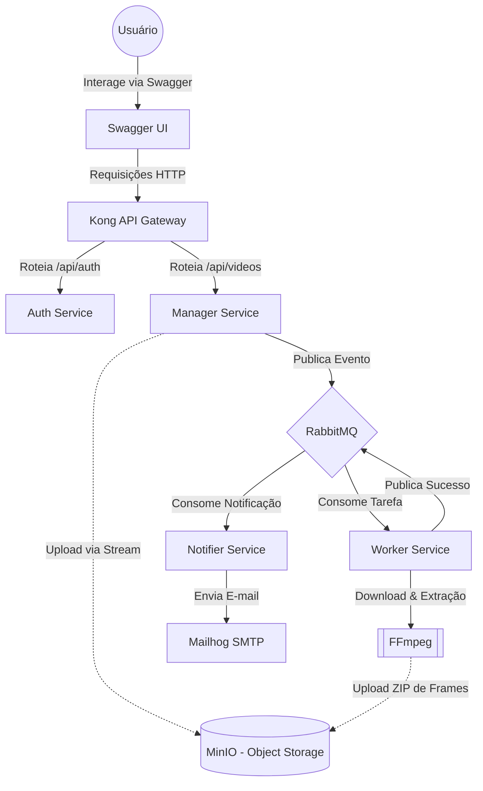

# FIAP X - Arquitetura de Microsserviços 🚀

Esta é a fundação da arquitetura **FIAP X**, um sistema distribuído robusto projetado para o processamento assíncrono de vídeos. A aplicação foi desenhada utilizando **Event-Driven Architecture**, **Database-per-service** e **Hexagonal Architecture (Ports & Adapters)** para garantir escalabilidade horizontal e resiliência.

Este repositório (`fiapx-infra`) atua como a **Infraestrutura como Código (IaC)** e **Source of Truth (GitOps)** do sistema. Ele contém os manifestos Kubernetes e Scripts para orquestração de toda a stack.

---

## 🏗️ System Design e Ecosistema

O ecossistema está particionado em 5 microsserviços independentes:

1.  **`fiapx-infra` (Este repositório):** Orquestração K8s, ConfigMaps, Secrets e **Kong API Gateway**.
2.  **`fiapx-auth`:** Serviço de Identidade (AuthN/AuthZ). Banco: `auth_db`.
3.  **`fiapx-manager`:** Orquestrador transacional de vídeos. Gerencia uploads via Stream para o MinIO. Banco: `video_db`.
4.  **`fiapx-worker`:** Motor de processamento. Extrai frames via **FFmpeg**. Operação assíncrona via RabbitMQ.
5.  **`fiapx-notifier`:** Serviço de engajamento. Dispara e-mails via Mailhog. Banco: `notification_db`.

### Fluxo de Dados e Eventos



---

## 🛠️ Como Executar Localmente (Minikube)

A stack completa roda em um cluster Kubernetes local.

### 1. Pré-requisitos
* **Docker Desktop** ativo.
* **Minikube** instalado.
* **kubectl** instalado.

### 2. Inicializar Cluster
Recomendamos a inicialização com recursos dedicados para garantir a estabilidade dos 11 pods:
```bash
minikube start --memory=6144 --cpus=4
```

### 3. Deploy da Stack
Utilize o script automatizado que gerencia a ordem correta de dependências (bancos -> jobs -> apps):
```bash
bash deploy-k8s.sh
```

---

## 🌐 Acesso e Port-Forward (Windows)

No ambiente local, utilizamos o `port-forward` para expor os serviços internos do cluster para o seu `localhost`.

### Passo 1: Abrir os Túneis
Execute em 3 terminais separados:
```powershell
# Terminal 1: Interface UI (Swagger)
kubectl port-forward svc/swagger-ui -n fiapx 30085:8080

# Terminal 2: Gateway de Entrada (Kong)
kubectl port-forward svc/kong -n fiapx 30080:8000

# Terminal 3: Verificação de E-mails (Mailhog)
kubectl port-forward svc/mailhog -n fiapx 30082:8025
```

### Passo 2: Entradas de Acesso
| Serviço | URL Local | Observação |
| :--- | :--- | :--- |
| **Swagger UI** | [http://localhost:30085](http://localhost:30085) | Portal centralizado para testar todas as APIs. |
| **Mailhog** | [http://localhost:30082](http://localhost:30082) | Visualize os e-mails enviados pelo Notifier. |
| **API Gateway** | [http://localhost:30080](http://localhost:30080) | Ponto de entrada das APIs (Auth e Manager). |

> [!NOTE]
> **Acesso ao Kong:** Ao acessar a raiz do Kong (`http://localhost:30080`) você verá o erro `"no Route matched"`. Isso é **esperado**, pois o Gateway apenas responde em rotas mapeadas (ex: `/api/auth/*` ou `/api/videos/*`). Para testar, utilize o **Swagger UI** que já está configurado para atravessar o Gateway corretamente.

---

## 🔄 CI/CD e GitOps

O projeto utiliza um pipeline moderno e automatizado:
* **GitHub Actions:** Executa builds, testes e gera imagens Docker automaticamente em cada Push.
* **Image Tag Sync:** O pipeline de CI atualiza automaticamente as tags de imagem neste repositório de infra.
* **ArgoCD:** (Opcional) Pode ser instalado no cluster para monitorar este repositório e sincronizar o estado da infra automaticamente (GitOps).
`/k8s`). Ao capitar a diferença descrita de YAML, ele efetua um Re-Deploy Hot Swap sem intervenção da equipe DevOps! (Zero-Downtime Pipeline).
