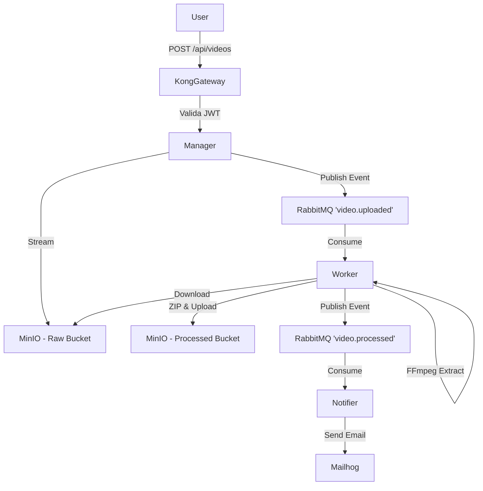

# FIAP X - Arquitetura de Microsserviços 🚀

Esta é a raiz lógica conceitual do projeto **FIAP X**, um sistema distribuído projetado para processamento assíncrono de vídeos. Para atender aos requisitos de avaliação de escalabilidade, resiliência e qualidade estrutural, a aplicação foi projetada utilizando **Event-Driven Architecture**, **Database-per-service** e **Ports & Adapters (Hexagonal)**.

Este repositório (`fiapx-infra`) atua como o **Centro de Operações (GitOps)** do sistema. Ele contém exclusivamente os manifestos Kubernetes e Scripts para a subida de toda a arquitetura de suporte (Gateway, Message Broker, Bancos de Dados, Object Storage e Mailer) e das APIs.

## 🏗️ System Design e Arquitetura

O sistema está dividido em 5 domínios/repositórios apartados físicos:

1. **`fiapx-infra` (Este repositório):** Orquestração K8s, ConfigMaps, Secrets, Volumes e definição do API Gateway (Kong).
2. **`fiapx-auth`:** Microsserviço de Identidade. Responsável por Login, Cadastro e prover JWT. Banco isolado (`auth_db`).
3. **`fiapx-manager`:** Microsserviço transacional de vídeos. Recebe uploads via Stream diretamente para o MinIO (S3), valida tokens JWT e gerencia metadados. Banco isolado (`video_db`).
4. **`fiapx-worker`:** Serviço em Background (Consumer). Lê a fila do RabbitMQ mantendo prefetch=1, processa o vídeo via FFmpeg baixando no `/tmp/`, extrai 5 frames, compacta em `.zip`, sobe pro Storage e avisa a rede.
5. **`fiapx-notifier`:** Serviço Mensageiro. Ouve os eventos de Sucesso ou Erro do Worker e dispara e-mails informativos transacionais via Nodemailer. Banco isolado (`notification_db`).

### Diagrama de Fluxo (E2E)



## 🛠️ Como subir o Ambiente Local (Avaliação)

Para simular o ambiente transacional E2E na sua máquina via **Minikube** (Kubernetes), você precisará rodar os comandos abaixo de forma sequencial. Eles criarão todos os pods, bancos, migrações e rotas da malha Kong.

**Requisitos:** Docker Desktop, Minikube e Kubectl instalados.

No seu terminal (dentro da pasta `fiapx-infra`), execute a seguinte ordem:

```powershell
# 1. Aplicar a fundação (Secrets, Configs, Namespaces)
kubectl apply -f k8s/namespace.yaml
kubectl apply -f k8s/secrets.yaml
kubectl apply -f k8s/configmap.yaml
kubectl apply -f k8s/postgres-init-configmap.yaml
kubectl create configmap swagger-config --from-file=infra/swagger/swagger-config.json -n fiapx
kubectl create configmap infra-scripts --from-file=infra/kong/setup-kong.sh --from-file=infra/minio/setup-buckets.sh -n fiapx

# 2. Aplicar a Infraestrutura e Middleware (Bancos, Gateway e Storage)
kubectl apply -f k8s/postgres-deployment.yaml
kubectl apply -f k8s/rabbitmq-deployment.yaml
kubectl apply -f k8s/minio-deployment.yaml
kubectl apply -f k8s/redis-deployment.yaml
kubectl apply -f k8s/kong-deployment.yaml
kubectl apply -f k8s/mailhog-deployment.yaml

# 3. Aguarde cerca de 15 segundos para os bancos subirem estabilizados... Em seguida, aplique os Microsserviços e Jobs Iniciais:
kubectl apply -f k8s/kong-migrations-job.yaml
kubectl apply -f k8s/auth-deployment.yaml
kubectl apply -f k8s/manager-deployment.yaml
kubectl apply -f k8s/worker-deployment.yaml
kubectl apply -f k8s/notifier-deployment.yaml
kubectl apply -f k8s/swagger-deployment.yaml

# 4. Jobs finais de povoamento de Buckets e registro de Rotas Ocultas
kubectl apply -f k8s/minio-setup-job.yaml
kubectl apply -f k8s/kong-setup-job.yaml
```

Verifique se a arquitetura subiu com estado Ready rodando: `kubectl get pods -n fiapx`.

## 📖 Acessando a Documentação Unificada (Swagger)

A aplicação congrega as rotas de Auth e Manager numa única interface de prova.
Adquira o IP dinâmico da sua VM local rodando o comando: `minikube ip`
Em seguida, acesse no navegador:

> **http://<MINIKUBE-IP>:30081/**

Você poderá logar, transferir o Token JWT pro "Authenticate" do Swagger, e enviar o arquivo de teste `test-video.mp4` para ser engolido pela fila do cluster.

Para ver os e-mails disparados com sucesso:
> **http://<MINIKUBE-IP>:30080/mailhog**
